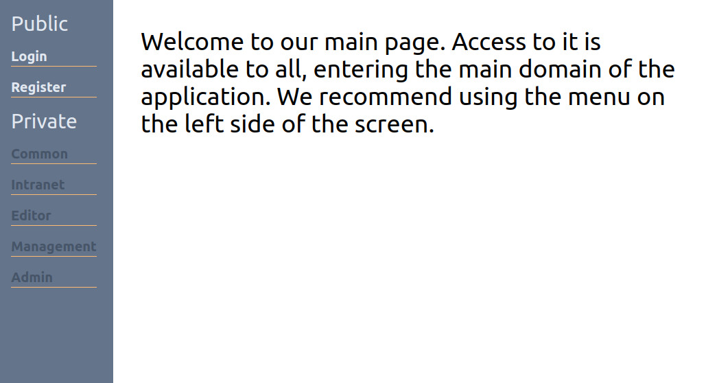
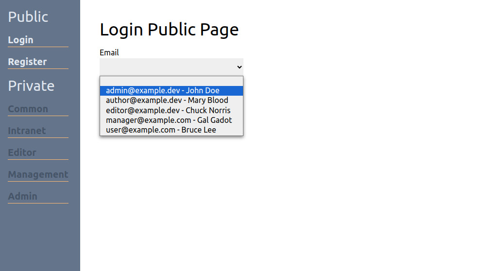
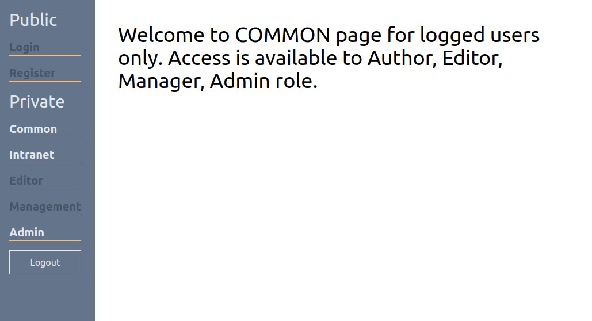
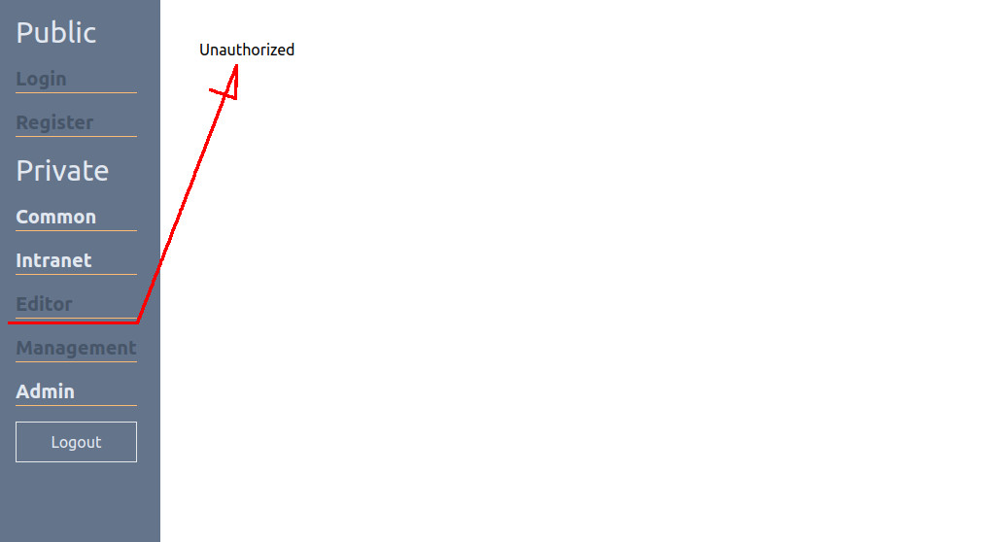

# Role-based auth with React, React Router, Redux Query

How to start the app

```
$ npm install
$ npm run dev
```

### Home Page - no auth

The application launches on the home page. 



### Login Page

The user can log in through the login page. For simplicity, logins (email addresses) associated with specific roles are selected. Roles to choose from include:

`user, admin, manager, editor, author`.



### Common

Each logged-in user has access to the Common page. The Intranet page is only available to employees who do not have the Author role.



### Editor page (Admin auth)

Depending on the setting of the css class: pointer-events-none, active or inactive links are provided for pages not accessible to the role.

If the links are active, the lack of permissions results in redirection to a page with information about the lack of access permissions.




## App configuration

```
$ npx create-react-app@latest ./ --template typescript

$ npm install -D tailwindcss postcss autoprefixer json-server concurrently react-toastify @reduxjs/toolkit react-redux
$ npx tailwindcss init -p
```

```
// tailwind.config.js
content: [
    './src/**/*.{js,jsx,ts,tsx}',
],
```

```
/* index.css */
@tailwind base;
@tailwind components;
@tailwind utilities;
```

```
// package.json
"scripts": {
    //...
    "dev": "concurrently \"json-server --watch ./src/data/db.json --port 4000\" \"npm start\""
},
```

Start the app

```
npm run dev
```


